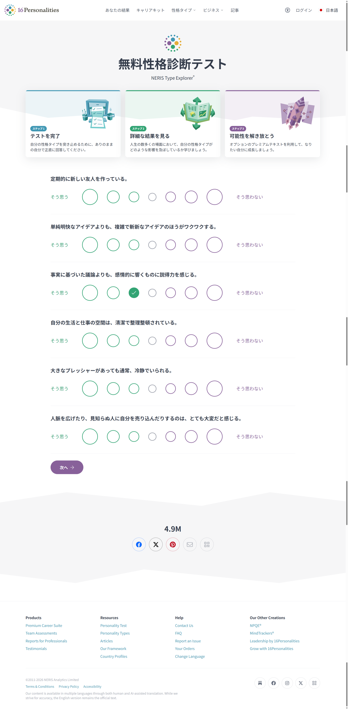

デザイン
- 全体的にカラフル過ぎるのでグラデーションは使わず配色は4色、赤黄緑青だけにして。
- 「AIで作った感」が絶対に出ないように、モダンで洗練されたシンプルなデザインにして。基本的にMBTIのページのデザインを参考にしてもらって大丈夫
- 入力画面のUIはに忠実に似せてほしい
- 診断結果では、CLVSのように4軸の値をアルファベット1文字にしたやつを連結したものを表示して。また、診断結果に載せるコンテンツやレイアウト、デザインはすべて　に載せた既存のMBTIサイトの結果画面を参考にして。忠実に似せてほしい